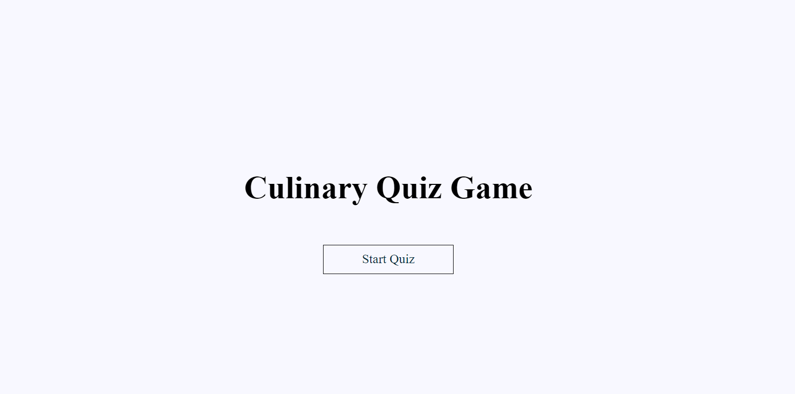
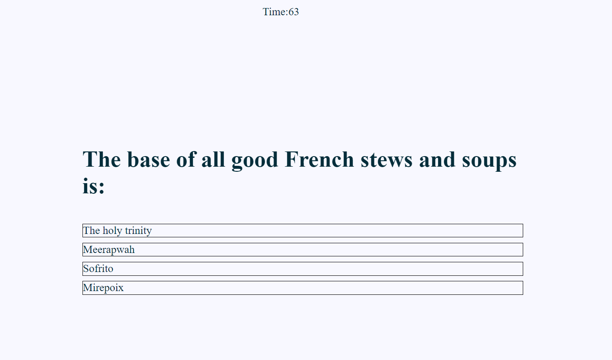
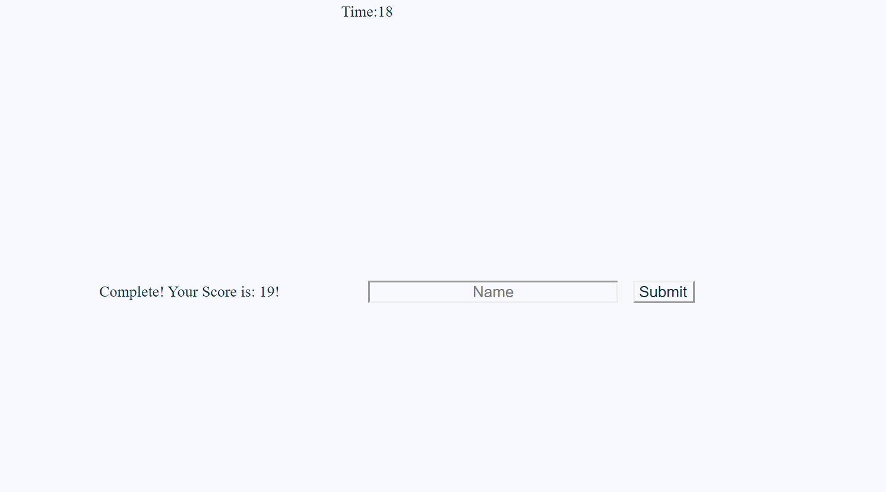

## Web-APIs homework number 4
This is a timed quiz testing your knowledge of a small part of the culinary world. you will have 75 seconds to answer 5 questions. Google is allowed but you have you be quick. If a question is answered incorrectly, there will be a five second time penalty and you will move on to the next question. The score will be whatever the time limit is at the end of the quiz. 

## Javascript Used
The Javascript used in this application is primarily for populating the question and answer boxes, as well as keeping time and submitting the users name and scores. The users and scores are saved on local storage in the DOM. 

## Styling 
The styling is simple and straight forward. 

background-color: ghostwhite;
font-color: #042d3a
font-family: 'Times New Roman', Times, serif;
Box-shadow: #80defa;
All content is centered. 

## Screenshots 

